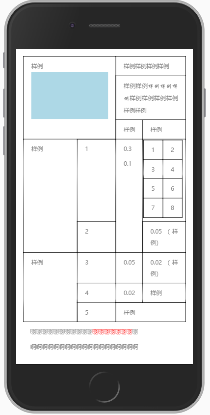

# word-to-html

<div align=center>
    
</div>

## feature
- images
- font-size color/style
- table
- link


## example
```javascript
var path = require("path");
var Word2html = require("word-to-html");
//Word document's absolute path
var absPath = path.join(__dirname, "test.docx");

const word2html = new Word2html(
    absPath,
    {
        outputDir: path.resolve(__dirname, 'temp')
    }
);
word2html.convert();
```

## event

### zipReady
- callback `<Function>`
    - zip `<admZip>`

you can use `zip` to get any resource you need, like images; [adm-zip](https://www.npmjs.com/package/adm-zip)

```javascript
var path = require("path");
var Word2html = require("word-to-html");
//Word document's absolute path
var absPath = path.join(__dirname, "test.docx");

const word2html = new Word2html(
    absPath,
    {
        outputDir: path.resolve(__dirname, 'temp')
    }
);
word2html.on('zipReady', (zip) => {
    // https://github.com/cthackers/adm-zip/wiki/ADM-ZIP#introduction
    zip.getEntries();
    // extractAllTo
    zip.extractAllTo(path.resolve(__dirname, 'temp/entryfiles'));
});
word2html.convert();
```
